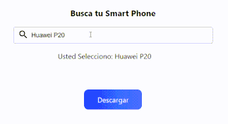

<div>
  
</div>

## Yei Input

Yei Input, es un plugin para realizar busquedas con previsualización de imagenes.

<div>
  
</div>

### [Ver Live Preview](https://josechirinos.github.io/plug-yei-input/)
## Download

  [Descargar Yei Input](https://github.com/JoseChirinos/plug-yei-input/archive/master.zip)

## Requisitos:

- [jQuery v3+](https://jquery.com/download/)

## Instalación:

1. Incluir los **estilos** a nuestro archivo `html`


```html
  <link rel="stylesheet" href="dist/yei-input.min.css">
```

2. Incluir **jQuery**

```html
  <script src="https://code.jquery.com/jquery-3.3.1.min.js"></script>
```

3. Incluir **yei-input**

```html
  <script src="dist/yei-input.min.js"></script>
```

## Sobre su uso

  Muy bien ahora para usar yei-input:

1. Declarar un contenedor para nuestro buscador:

```html
  <div id="yei-input"></div>
```
2. Iniciar Yei.
```js
  var yeiInput = new yei({
    element: "yei-input",
    placeholder: "Buscar...",
    key:['name'],
    list:datos, // arraylist con objetos
    imageDefault: 'images/default.jpg',
    callback: function(res){
      // res: es un objeto resultante
      
      /*
      * Aqui tu código
      */
    }
  })
```

## Opciones
  Dentro de las opciones tenemos las siguientes:

  - `element:` aqui va el ID del contenedor donde estara nuestro buscador.

  - `placeholder:` es un texto ayuda, para mostrar en el input

  - `key:` es el valor que queremos buscar ej.

    ```js
      {
        name: 'Samsung S9',
        detail: 'El mejor Smartphone'
        year: '2018'
      }
    ```

    Queremos que la busqueda se enfoque en el name y year:

    ```js
      var yeiInput = new yei({
        element: "yei-input",
        placeholder: "Buscar...",
        key:['name', 'year'], // indicamos que se enfoque en name y year
        list:datos, 
        imageDefault: 'images/default.jpg',
        callback: function(res){
          /*
          * Aqui tu código
          */
        }
      })
    ```
  - `list:` es un array con objetos, en el cual se realizara la busqueda ej:

  ```js
    [
      {
        name: 'Samsung S9',
        detail: 'El mejor Smartphone'
        year: '2018'
      },
      {
        name: 'Huawei P20',
        detail: 'Disfruta de la mejor camara'
        year: '2018'
      },
      {
        name: 'iPhone X',
        detail: 'Tenemos animojis'
        year: '2018'
      }
    ]
  ```

  - `imageDefault:` es la imagen que se mostrara cuando no hay resultados o aun no se a buscado.

  - `callback:` como lo dice su nombre es un callback, que se ejecuta una ves que elegimos un item, te enviamos un `res` que es el objeto seleccionado.


## Enjoy...!!!
  Gracias por utilizar yei-input,
  Esta libreria mejorara mucho más, si quieres colaborar con el proyecto escribeme a mi cuenta de twitter, [@JseChirinos](https://twitter.com/jsechirinos).


